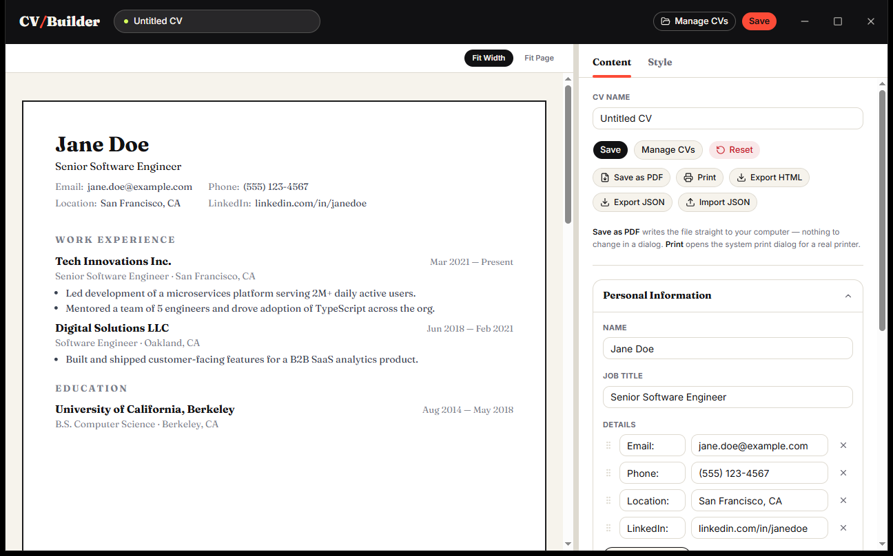
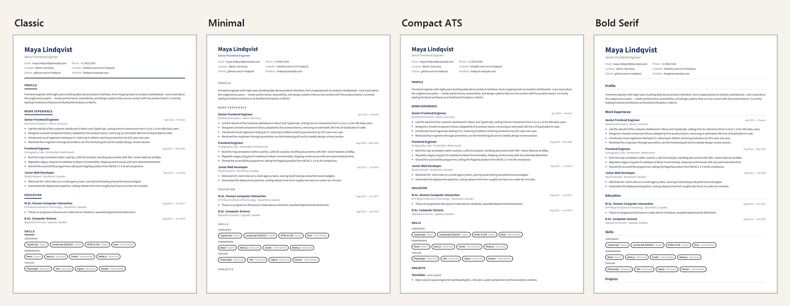
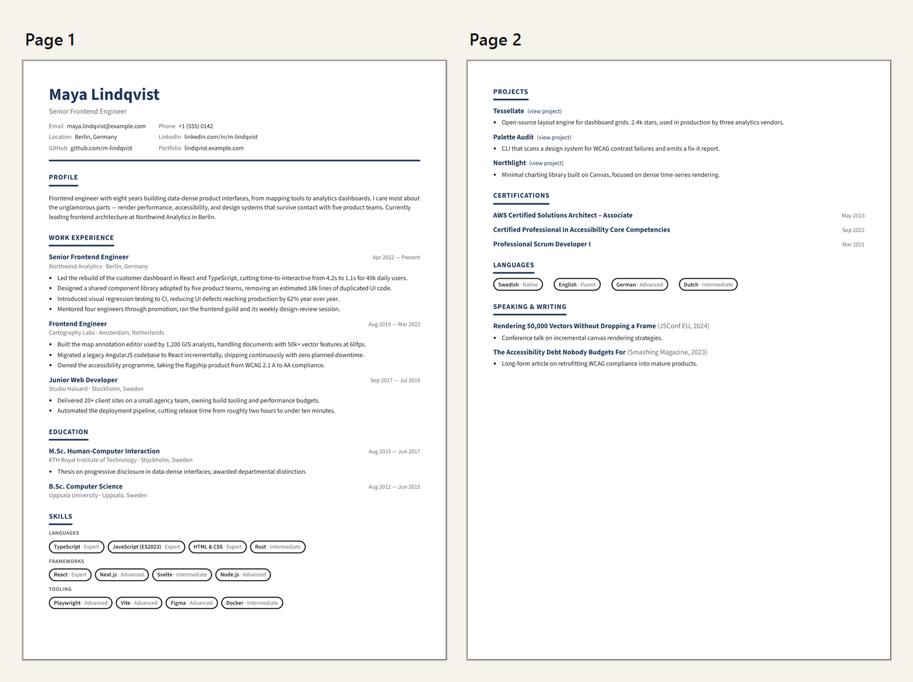
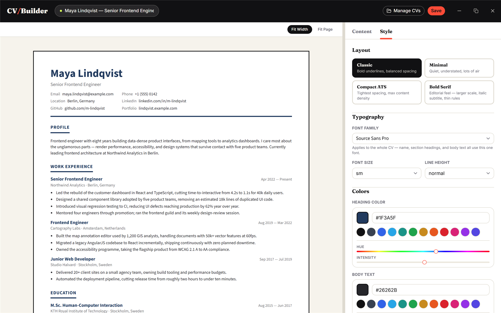

# CV Builder

A CV/resume builder that runs entirely on your machine, as a desktop app or in the browser. Build a resume, restyle it live, and export it to PDF, HTML, or JSON. No account, no server, no data leaving your computer.

[](#-leave-a-tip)



## Download

**[Download the latest Windows installer →](https://github.com/UMA1R-01/CV-Builder/releases/latest)**

Grab `CV Builder_x.y.z_x64-setup.exe` from the release assets and run it. It installs to
`%LOCALAPPDATA%\Programs\CV Builder` with Start Menu and desktop shortcuts, and registers an
uninstaller.

The installer is unsigned, so Windows SmartScreen will warn on first run. Choose **More info →
Run anyway**. It relies on the WebView2 runtime, which ships with Windows 10 and 11 already; on a
machine without it, the installer offers to fetch it.

Prefer to build it yourself? See [Getting started](#getting-started).

## Why

Most online resume builders want an account, keep your employment history on their servers, and paywall the PDF export. This one has no backend at all: everything lives in `localStorage`, and every export is produced locally by your own machine.

## Features

- **Live paginated preview**: content is measured and packed into real A4/Letter pages as you type, so what you see is what prints. Sections can be forced onto a new page.
- **Drag-and-drop everything**: reorder sections, entries within a section, and personal-info fields.
- **Seven section types**: work experience, education, skills, projects, certifications, languages, and free-form custom sections, each with its own fields and sort rules.
- **Four layout presets**: all deliberately single-column, since multi-column resumes parse unreliably in ATS software.
- **Deep styling**: 16 font families, size and line-height scales, heading/body colours, margins, section spacing, header alignment, personal-info column grid, and date formatting.
- **Real vector PDF**: rendered through the browser/WebView print engine rather than rasterised, so text stays sharp and selectable at any zoom.
- **Multiple saved CVs**: keep several versions side by side, with autosave of work in progress.
- **Import/export**: portable JSON for backup, standalone HTML with styles inlined.

### Four layouts, one click apart

Every preset restyles the whole document (borders, casing, weight, and spacing) without touching your content or its reading order.



### Pagination that matches the print output

Blocks are measured after they render, then packed into pages. Nothing is ever split mid-entry, so a job or a degree never straddles a page break.



### Style controls, applied live

Layout, typography, colour, spacing and date format all update the preview as you change them.



## Desktop vs. browser

The same codebase ships both ways. The desktop build adds native OS integration on top:

| | Desktop (Tauri) | Browser |
| --- | --- | --- |
| Save as PDF | Native save dialog, writes the PDF directly, no headers or footers to switch off | System print dialog, set destination to "Save as PDF" |
| Export HTML/JSON | Native save dialog, you choose the location | Downloads folder |
| Import JSON | Native file picker | `<input type="file">` |
| Window | Frameless, app header doubles as the title bar | Normal browser tab |
| External links | Open in your default browser | Normal navigation |

The frontend detects which environment it is in at runtime, so the browser build keeps working with no Tauri installed.

## Tech stack

- **[React 19](https://react.dev)** + **[TypeScript](https://www.typescriptlang.org)**
- **[Vite 8](https://vite.dev)** for dev server and bundling
- **[Tailwind CSS v4](https://tailwindcss.com)**: configured CSS-first, no `tailwind.config.js`
- **[shadcn/ui](https://ui.shadcn.com)** on **[Radix UI](https://www.radix-ui.com)** primitives
- **[@dnd-kit](https://dndkit.com)** for drag-and-drop
- **[lucide-react](https://lucide.dev)** for icons
- **[Tauri v2](https://tauri.app)** (Rust) for the desktop shell
- **[Oxlint](https://oxc.rs)** for linting

## Getting started

### Prerequisites

For the **web** build you only need [Node.js](https://nodejs.org) 20.19+ or 22.12+.

The **desktop** build additionally needs the [Tauri v2 prerequisites](https://tauri.app/start/prerequisites/) for your platform. On Windows that means:

- [Rust](https://rustup.rs) (stable, MSVC toolchain)
- Microsoft C++ Build Tools, including the Windows SDK
- WebView2 Runtime, preinstalled on Windows 10/11

### Install

```bash
git clone https://github.com/UMA1R-01/CV-Builder.git
cd CV-Builder
npm install
```

### Run

```bash
npm run dev
```

```bash
npm run tauri:dev
```

`npm run dev` serves the web app at `http://localhost:5173`; `npm run tauri:dev` launches the desktop window and starts Vite automatically. The first desktop run compiles the whole Rust dependency tree and can take 10–25 minutes. Later runs take seconds.

### Build

```bash
npm run build
```

```bash
npm run tauri:build
```

`npm run build` type-checks and bundles to `dist/`; `npm run tauri:build` produces a desktop installer in `src-tauri/target/release/bundle/`. Lint with `npm run lint`.

There is no test runner configured; `tsc -b` (run as part of `npm run build`) is the automated safety net.

## Project structure

```
src/
  components/cv/     CV editor, live preview, style controls, dialogs
  components/ui/     shadcn/ui primitives
  hooks/useCVData.ts Reducer owning all CV content mutations
  services/          Persistence, exporters, Tauri bridge
  constants.ts       Defaults, presets, page dimensions
  types.ts           CVData / StyleConfig model
src-tauri/
  src/lib.rs         Window setup, external-link guard
  src/files.rs       Native save/open dialog commands
  src/pdf.rs         Direct-to-PDF via WebView2
```

## How a few things work

**Pagination.** The preview renders the document twice: once visibly, and once into an offscreen container used purely for measurement. Real rendered block heights are read back and greedily packed into pages, so page breaks reflect actual typography rather than an estimate.

**PDF export.** On the web this calls `window.print()` on the live document, with `@media print` rules isolating the CV from the app chrome. On desktop it calls WebView2's `PrintToPdf`, which uses the same engine but writes straight to a file with headers/footers disabled and the page size taken from the selected paper format.

**Storage.** Work in progress is autosaved to `localStorage` on a debounce; explicit saves go to a separate list of named CVs. Saved styles are merged with defaults on load, so older saved data survives new style options being added.

## Customising the app icon

The desktop icon is generated from a single source SVG:

```bash
npx tauri icon src-tauri/app-icon.svg
```

## ☕ Leave a tip

💛 If you like this app, a tip is always welcome!

| | |
|:--|:--|
|  | Native BTC only |
|  | ETH / USDC on Base only |
|  | SOL / SPL tokens only |

 **Bitcoin**

```
bc1qs25pegh3232q9j58kt5dgczymcj4pg8a5un2zp
```

 **Base**

```
0x81F29C9Dca41cb57395BE5b56c7606653A8c2E34
```

 **Solana**

```
G57VrGCbAFWSe2vPfx2ZrUUxzJeiARncKUkYMxw3wKVa
```

## License

[MIT](LICENSE) © Umair Aamir
